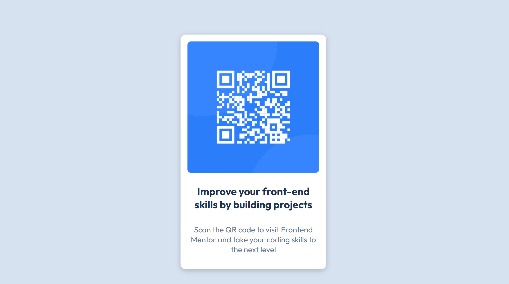

# Frontend Mentor - QR code component solution

This is a solution to the [QR code component challenge on Frontend Mentor](https://www.frontendmentor.io/challenges/qr-code-component-iux_sIO_H). Frontend Mentor challenges help you improve your coding skills by building realistic projects. 

## Table of contents

- [Overview](#overview)
  - [Screenshot](#screenshot)
  - [Links](#links)
- [My process](#my-process)
  - [Built with](#built-with)
  - [What I learned](#what-i-learned)
  - [Continued development](#continued-development)
  - [Useful resources](#useful-resources)
- [Author](#author)
- [Acknowledgments](#acknowledgments)

## Overview

We all have to start somewhere... 
This is a basic website with an image and some text. 
Let's see what I did to make it happen. 

### Screenshot

[]

### Links

- Solution URL: [Add solution URL here](https://github.com/aevaksnes/qr-code-component-main)
- Live Site URL: [Add live site URL here](https://your-live-site-url.com)

## My process

### Built with

- Semantic HTML5 markup
- CSS custom properties
- Flexbox
- VSStudio Copilot

### What I learned

Even though I have gone through some courses and know a little bit of everything, just figuring out where to start is sometimes very difficult. 
It was a good project to get going. I knew already that design is not my strong suite, I never really understood when to use flexbox and when to use grid. 
I also found that it is quite useful to ask the copilot for tips when I don't remeber how to do stuff, like the rounding of the corners, the shadow effect... 

### Continued development

I am not really sure how I would go about making the design is ready for different size screens other than using flexbox. 
Is it necesarry to use media queries in this case? 

### Useful resources

I mostly used the copilot when I was stuck. Highly recommend. 

## Author

Eva

## Acknowledgments

As of now, this is my first attempt of solving this project... But if there are any feedback, there might be some people that needs mentioning here...

